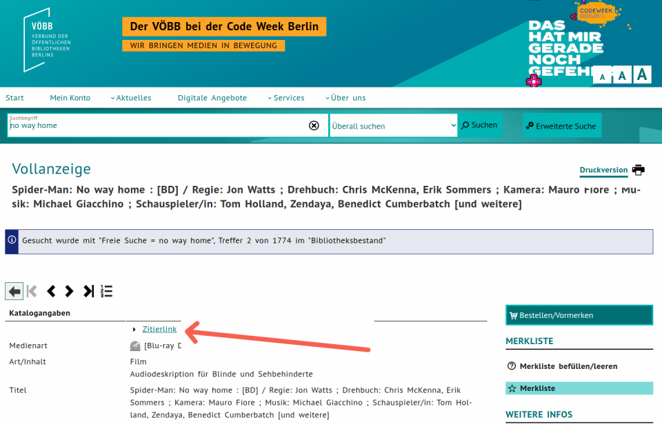
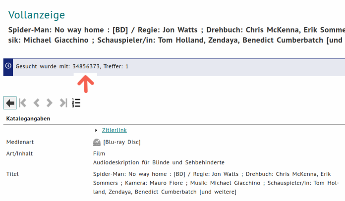

# voebb-wunschliste
Ein alternativer Merkzettel für die öffentlichen Bibliotheken Berlins mit Verfügbarkeitsprüfung an Wunschstandorten.

## Features

* Führen einer Liste von Wunschbibliotheken
* Führen einer Liste von Medien
* Abgleich ob Wunschmedien in Wunschbibliothek aktuell verfügbar sind und Ausgabe dessen auf der Command Line sowie versand via Mail


Beispielhafte Ausgabe:
```commandline
INFO:root:Verfügbarkeit von 6 Medien wird in 2 Bibliotheken geprüft
INFO:root:34896410
INFO:root:34891699
INFO:root:34856373
INFO:root:34845025
INFO:root:34908172
INFO:root:34723602
WARNING:root:Folgende Medien sind aktuell verfügbar:
INFO:root:+----------+------------------------------------+-------------------------------------+-----------------------------------------------------------------------------------------------+
|       ID | ORT                                | TITEL                               | DIREKTLINK                                                                                    |
+==========+====================================+=====================================+===============================================================================================+
| 34891699 | Mitte: Bibliothek am Luisenbad ->  | Phantastische Tierwesen -           | https://www.voebb.de//aDISWeb/app?service=direct/0/Home/$DirectLink&sp=SPROD00&sp=SAK34891699 |
|          | Erwachsenenbereich -> TopTitel     | Dumbledores Geheimnisse / Regie:    |                                                                                               |
|          |                                    | David Yates ; Drehbuch: Joanne K.   |                                                                                               |
|          |                                    | Rowling, Steve Kloves ; Kamera:     |                                                                                               |
|          |                                    | George Richmond ; Musik: James      |                                                                                               |
|          |                                    | Newton Howard ; Schauspieler/in:    |                                                                                               |
|          |                                    | Mads Mikkelsen, Jude Law, Eddie     |                                                                                               |
|          |                                    | Redmayne [und andere]               |                                                                                               |
+----------+------------------------------------+-------------------------------------+-----------------------------------------------------------------------------------------------+
| 34845025 | Mitte: Bibliothek am Luisenbad ->  | Freiheit für alle : das Ende der    | https://www.voebb.de//aDISWeb/app?service=direct/0/Home/$DirectLink&sp=SPROD00&sp=SAK34845025 |
|          | Erwachsenenbereich -> SoP 795 Prec | Arbeit wie wir sie kannten /        |                                                                                               |
|          |                                    | Richard David Precht                |                                                                                               |
+----------+------------------------------------+-------------------------------------+-----------------------------------------------------------------------------------------------+
| 34845025 | Mitte: Schiller-Bibliothek mit     | Freiheit für alle : das Ende der    | https://www.voebb.de//aDISWeb/app?service=direct/0/Home/$DirectLink&sp=SPROD00&sp=SAK34845025 |
|          | @hugo Jugendmedienetage ->         | Arbeit wie wir sie kannten /        |                                                                                               |
|          | Erwachsenenbereich / Bestseller -> | Richard David Precht                |                                                                                               |
|          | SoP 795 Prec                       |                                     |                                                                                               |
+----------+------------------------------------+-------------------------------------+-----------------------------------------------------------------------------------------------+
| 34908172 | Mitte: Schiller-Bibliothek mit     | Doctor Strange in the multiverse of | https://www.voebb.de//aDISWeb/app?service=direct/0/Home/$DirectLink&sp=SPROD00&sp=SAK34908172 |
|          | @hugo Jugendmedienetage ->         | madness / Regie: Sam Raimi ;        |                                                                                               |
|          | Erwachsenenbereich -> TopTitel     | Drehbuch: Michael Waldron ; Kamera: |                                                                                               |
|          |                                    | John Mathieson ; Musik: Danny       |                                                                                               |
|          |                                    | Elfman ; Schauspieler/in: Benedict  |                                                                                               |
|          |                                    | Cumberbatch, Elizabeth Olsen,       |                                                                                               |
|          |                                    | Chiwetel Ejiofor [und andere]       |                                                                                               |
+----------+------------------------------------+-------------------------------------+-----------------------------------------------------------------------------------------------+
WARNING:root:Folgende Medien sind in keiner der gewählten Bibliotheken vorhanden:
INFO:root:+----------+-----------------------------------+-----------------------------------------------------------------------------------------------+
|       ID | TITEL                             | DIREKTLINK                                                                                    |
+==========+===================================+===============================================================================================+
| 34723602 | Dominion : Basisspiel ; [Spiel] / | https://www.voebb.de//aDISWeb/app?service=direct/0/Home/$DirectLink&sp=SPROD00&sp=SAK34723602 |
|          | Donald X. Vaccarino               |                                                                                               |
+----------+-----------------------------------+-----------------------------------------------------------------------------------------------+

Process finished with exit code 0


```

## HowTo

### Bibliotheksliste pflegen

* standortliste-full.txt mit allen Standorten öffnen
* unerwünschte Einträge löschen
* umbenennen nach standortliste.txt

### Medienliste pflegen

* Medium über die [voebb-Seite](https://www.voebb.de/aDISWeb/app?service=direct/0/Home/$DirectLink&sp=SPROD00) suchen
* Zitierlink ermitteln 
* ID des Mediums kopieren 
* ID zu medienliste.txt hinzufügen. (eine ID pro Zeile erleubt)

### Mail Versand konfigurieren

* Datei `config.ini` mit Texteditor
* Folgendende Zeilen adaptiert hinzufügen:
```ini
[Mailing]
SmtpServerAddress = smtp.web.de
SmtpServerPort = 587
User = <sender mail address>
Password = <password>
Recipients = <comma separated list mail addresses>
```